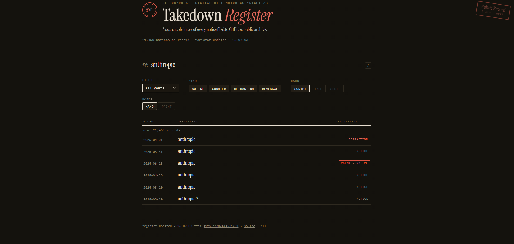
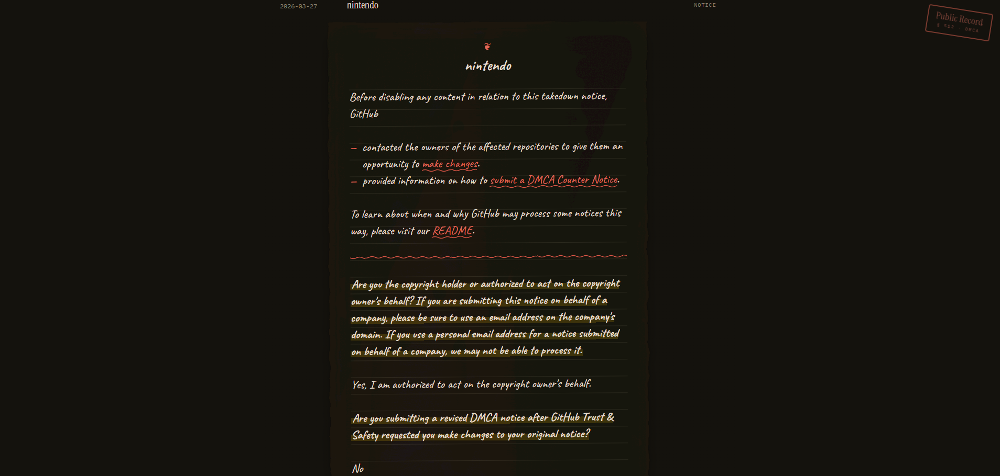

<p align="center">
  
</p>

<h1 align="center">dmca-search</h1>

<p align="center">
  Client-side search over <a href="https://github.com/github/dmca">github/dmca</a>,
  GitHub's public archive of DMCA takedown notices.
  <br>
  <a href="https://dmca-search.riyo.me"><strong>dmca-search.riyo.me</strong></a>
</p>





## How it works

- The build (`scripts/build-index.mjs`) lists every notice in `github/dmca` (blobless clone + `git ls-tree`) and emits a compact JSON index.
- The site is fully static. Search runs in the browser over that index — no server, no tracking.
- Each result links to the original notice on GitHub; previews are fetched on demand from `raw.githubusercontent.com`, with `[private]` markers shown as redactions.
- Hosted on Vercel, which runs the build on every deploy; a daily GitHub Actions job re-deploys so the index stays current.

## Usage

Type to search notice names (`nintendo`, `youtube-dl`, …). Multiple terms are ANDed.
Results can be filtered by year and by kind (notice, counter notice, retraction, reversal), laid out as a list or a card grid.

Opened notices render their markdown on a textured paper page. The typeface (script / type / serif) and the notation (hand-drawn / print) are switchable; choices persist in the browser. `[private]` markers appear as pen scribbles — hover to peek.

## Development

```sh
npm run build      # writes site/data/index.json
npx serve site     # any static file server works
```

Deploy with `vercel --prod` (build runs on Vercel; no committed index).

## License

MIT. The notices themselves are published by the upstream [github/dmca](https://github.com/github/dmca) repository; see its README for terms.
